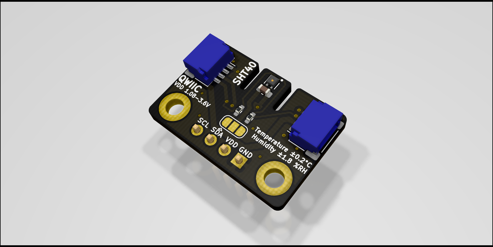

# SHT4x Breakout
Sensirion [SHT4x](https://www.sensirion.com/en/environmental-sensors/humidity-sensors/humidity-sensor-sht4x/) Breakout board with Qwiic/STEMMA QT connectors and breadboard friendly pin headers. 

